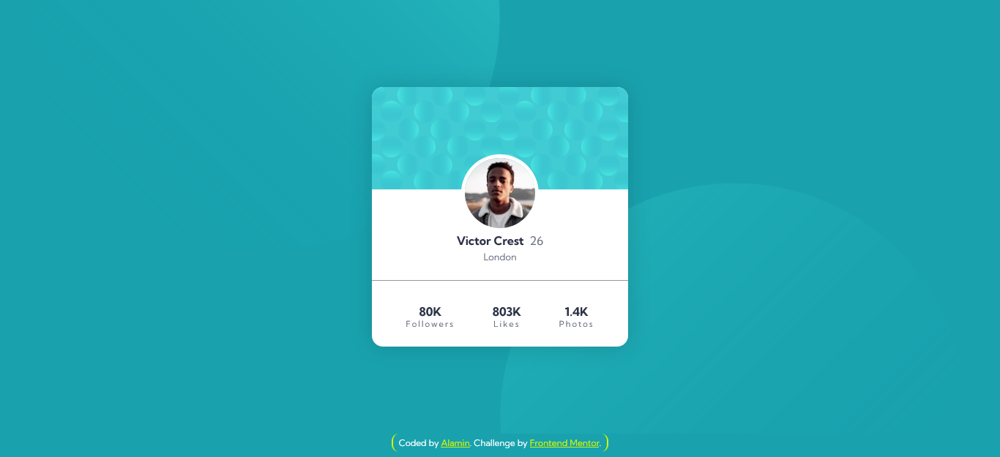

# Frontend Mentor - Profile card component solution

This is a solution to the [Profile card component challenge on Frontend Mentor](https://www.frontendmentor.io/challenges/profile-card-component-cfArpWshJ). Frontend Mentor challenges help you improve your coding skills by building realistic projects. 

## Table of contents

- [Overview](#overview)
  - [The challenge](#the-challenge)
  - [Links](#links)
  - [Screenshot](#screenshot)
- [My process](#my-process)
  - [Built with](#built-with)
- [Author](#author)

## Overview

### The challenge

- Build out the project to the designs provided

### Links

- [👉Live Site URL](https://codepapa360.github.io/profile-card-component/)
 

- [👉Solution URL]()

### Screenshot

#### Desktop preview

#### Mobile preview 

## My process

### Built with

- Semantic HTML5 markup
- CSS custom properties
- Flexbox
- Mobile-first workflow

## Author

- Frontend Mentor - [@CodePapa360](https://www.frontendmentor.io/profile/CodePapa360)
- Twitter - [@CodePapa360](https://www.twitter.com/CodePapa360)
- LinkedIn - [@CodePapa360](https://www.linkedin.com/in/codepapa360)
